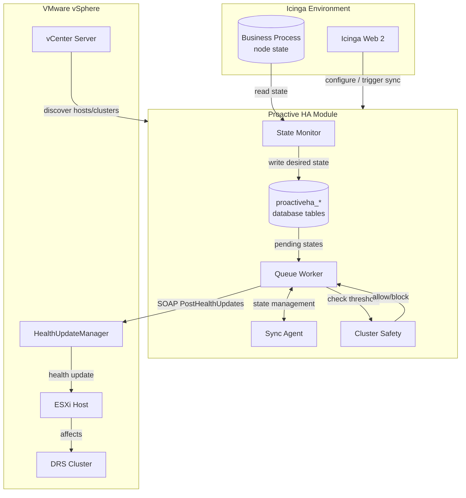

<p align="center"></p>

# Proactive HA Module for Icinga Web 2

[](https://icinga.com)

Bridge Icinga Business Process (BP) node states to VMware vSphere [Proactive HA](https://github.com/bmtwl/icingaweb2-module-proactiveha/wiki/Proactive-HA-Description) health updates.

## Overview

This module monitors Icinga Business Process nodes and pushes their state to VMware vCenter's [Proactive HA](https://github.com/bmtwl/icingaweb2-module-proactiveha/wiki/Proactive-HA-Description) framework. When a BP node becomes WARNING or CRITICAL, the mapped ESXi host receives a corresponding yellow or red health update in vSphere.



## How It Works

1. **State Monitor** periodically reads Business Process node states
2. **State Translator** maps Icinga states to vSphere health states:
   - `OK` → `green`
   - `WARNING` → `yellow`
   - `CRITICAL` → `red`
3. **Cluster Safety** checks whether pushing red to a host would violate the configured minimum number of non-red hosts for that cluster
4. **Queue Worker** pushes pending states to vCenter via SOAP
5. vCenter applies health updates to ESXi hosts that are part of a Proactive HA-enabled cluster

## Cluster Safety

Each cluster configuration includes a **Minimum Non-Red Hosts** threshold (default: 1). This prevents the module from pushing red health updates to so many hosts that the cluster could place all mapped hosts into maintenance mode.

How it works:
- Only **mapped** hosts in the cluster are counted
- Hosts with no state record, or with `push_status = blocked`, are treated as effectively red
- If pushing red would leave fewer than the configured number of non-red mapped hosts, the push is blocked
- Blocked pushes set `push_status = blocked` and are logged
- Manual pushes, forced states, and CLI commands all respect this threshold
- Mappings with unknown cluster membership bypass the check with a warning

To disable this protection for a cluster, set **Minimum Non-Red Hosts** to `0`.

## Requirements

- Icinga Web 2
- PHP ≥ 7.4 with `soap`, `openssl`, `pdo` extensions
- Icinga PHP Library
- Icinga Business Process module
- VMware vCenter with Proactive HA licensed and enabled
- vCenter service account with permissions to:
  - Register/unregister HealthUpdate providers
  - Add/remove monitored entities
  - Read hosts and clusters

> **Note:** Enabling Proactive HA on a cluster requires `Host.Inventory.EditCluster` permission and must be done separately by a vCenter administrator. This module intentionally does not perform that step.

## Installation

```bash
cd /usr/share/icingaweb2/modules
git clone https://github.com/bmtwl/icingaweb2-module-proactiveha.git proactiveha
icingacli module enable proactiveha
```

## Configuration

### 1. Database Resource

Create a database resource (PostgreSQL recommended as it is the one we use, therefore the most well tested) in Icinga Web 2 under **Configuration → Application → Resources**, then select it in **Proactive HA → Database Configuration**.

Alternatively, edit `/etc/icingaweb2/modules/proactiveha/config.ini`:

```ini
[database]
resource = "proactiveha_db"
```

Initialize the schema:

```bash
icingacli proactiveha initdb
```

Alternatively, use the schema definitions in `etc/schema` to manually initialize the DB of your choice.

### 2. Encryption Key

The module encrypts vCenter passwords. Generate the key on first use via the web UI, or manually:

```bash
mkdir -p /etc/icingaweb2/modules/proactiveha
openssl rand -base64 32 > /etc/icingaweb2/modules/proactiveha/key.pem
chmod 600 /etc/icingaweb2/modules/proactiveha/key.pem
chown www-data:icingaweb2 /etc/icingaweb2/modules/proactiveha/key.pem
```

### 3. vCenter Connection

Navigate to **Proactive HA → vCenter Connections → Add vCenter**.

| Field | Description |
|-------|-------------|
| Name | Display name |
| URL | `https://vcenter.example.com/` |
| Username | Service account username |
| Password | Service account password |
| Verify SSL | Disable only for self-signed/internal CAs |
| Enabled | Whether this connection is active |

Click **Test** to verify connectivity and provider registration.

### 4. Cluster Configuration

Navigate to **Proactive HA → Clusters → Add Cluster**.

This registers the provider and adds cluster hosts as monitored entities. It does **not** enable Proactive HA on the cluster — a vCenter administrator must do that separately either through the GUI or via automation, for example with [William Lam's PowerCLI library](https://williamlam.com/2017/03/powercli-module-for-proactive-ha-including-simulation.html).

| Field | Description |
|-------|-------------|
| vCenter / Cluster | Select a vSphere cluster |
| Cluster Mode | Manual or Automated |
| Moderate Remediation | Quarantine Mode or Maintenance Mode |
| Severe Remediation | Quarantine Mode or Maintenance Mode |
| Minimum Non-Red Hosts | Minimum mapped hosts that must stay out of red (0 disables protection) |
| Enabled | Whether this configuration is active |

```powershell
Set-PHAConfig `
    -Cluster "DR Cluster" `
    -Enabled `
    -ClusterMode Manual `
    -ModerateRemediation QuarantineMode `
    -SevereRemediation QuarantineMode `
    -ProviderId "52 01 85 bb 43 dc 1c eb-8b 2a c3 bd 6d a4 74 9d"
```

### 5. Mappings

Navigate to **Proactive HA → Mappings → Add Mapping**.

| Field | Description |
|-------|-------------|
| vCenter | Select configured vCenter |
| Business Process Node | BP config and node to monitor |
| vSphere Host Name | Host name as shown in vSphere |
| vSphere Host MOID | Optional; auto-resolved if empty |
| Enabled | Whether this mapping is active |

When a mapping is saved or its MOID is resolved, the module attempts to determine which configured cluster the host belongs to. This cluster membership is required for the cluster safety feature.

## Operation

### Automatic Sync

Run the monitor and worker as systemd services or cron jobs.

```bash
# One-shot evaluation
icingacli proactiveha monitor run --once

# One-shot push
icingacli proactiveha worker run --once

# Combined sync
icingacli proactiveha sync run
```

### systemd Services

Install the provided service and timer files:

```bash
cp etc/systemd/*.service /etc/systemd/system/
cp etc/systemd/*.timer /etc/systemd/system/
systemctl daemon-reload
systemctl enable --now proactiveha-monitor.timer
systemctl enable --now proactiveha-worker.timer
```

The services run as `www-data:icingaweb2`. Adjust the user and group in the unit files if your distribution uses different names.

Default intervals:
- Monitor: every 30 seconds
- Worker: every 5 seconds

Adjust timers as needed.

### Manual Testing

Force a state for testing (id is the id value in the module database):

```bash
icingacli proactiveha forcestate --id <mapping-id> --state red --push
```

> **Note:** If the cluster safety threshold would be violated, the push will be blocked even with `--push`.

Check pending/failed/blocked states:

```bash
icingacli proactiveha pending
icingacli proactiveha pending --status failed
icingacli proactiveha pending --status blocked
```

Inspect current health updates known to vCenter:

```bash
icingacli proactiveha healthupdates list --id <vcenter-id>
```

## Health Update Status Meanings

When querying health updates via `healthupdates list`, vCenter returns one of the following statuses:

| Status | Meaning |
|--------|---------|
| `green` | Host is healthy (provider update active) |
| `yellow` | Host has a non-critical issue (provider update active) |
| `red` | Host has a critical issue (provider update active) |
| `gray` | No provider update is active for this host. This is expected when:<br>• Proactive HA is not enabled for the cluster, or<br>• The provider is not included in the cluster's provider list, or<br>• No health update has been sent for this host yet |

A gray status with an empty `id` field specifically indicates that vCenter has no record of a provider update for that host. If you see gray for a mapped host after pushing updates, verify the cluster's Proactive HA configuration with [`Get-PHAConfig`](https://williamlam.com/2017/03/powercli-module-for-proactive-ha-including-simulation.html).

## Push Status Meanings

The module uses the following push statuses:

| Status | Meaning |
|--------|---------|
| `synced` | State has been successfully pushed to vCenter |
| `pending` | State is waiting to be pushed |
| `in_progress` | Push is currently being attempted |
| `blocked` | Push blocked by cluster safety threshold |
| `failed` | Push failed after retries |

## Permissions

| Permission | Description |
|------------|-------------|
| `proactiveha/admin` | Full administrative access |
| `proactiveha/filter` | Restrict access to specific vCenter names |

## Troubleshooting

### Health updates return 200 but do not affect hosts

Verify the cluster has Proactive HA [enabled with your provider](https://williamlam.com/2017/03/powercli-module-for-proactive-ha-including-simulation.html).

```powershell
Get-PHAConfig -Cluster "Prod Cluster"
```

The provider must appear in the `HealthProviders` list.

Check current health updates:

```bash
icingacli proactiveha healthupdates list --id <vcenter-id>
```

If a host shows `gray` with an empty `id`, vCenter has not applied any provider update to it. This usually means the cluster's Proactive HA configuration does not include your provider for that host.

### Red pushes are blocked unexpectedly

Check the cluster's **Minimum Non-Red Hosts** setting. Remember:
- Only mapped hosts in the cluster are counted
- Hosts with no state record or `blocked` status count as effectively red
- If cluster membership is unknown for a mapping, the push is allowed with a warning

Use **Resolve MOID** on the mapping page to refresh cluster membership.

### 2-host clusters probably don't behave as you expect

see https://knowledge.broadcom.com/external/article/398787/the-limitation-of-proactive-ha-in-2node.html for more information

### SOAP errors

Use the module logs at **Proactive HA → Logs** or run CLI commands with `--trace` equivalent by checking `proactiveha_log`.

Common issues:
- Incorrect vCenter URL
- SSL certificate verification failure
- Missing permissions
- Provider not registered

### Business Process node not found

Ensure the BP config name and node name match exactly, including case.

### Cluster membership unknown

If logs show "cluster membership unknown" for a mapping:
1. Ensure the host is part of a configured cluster in **Proactive HA → Clusters**
2. Click **Resolve MOID** on the mapping to refresh cluster membership
3. Verify vCenter connectivity from the mapping's configured vCenter

## Security Considerations

- vCenter passwords are encrypted at rest with AES-256-CBC + HMAC
- The encryption key must be readable only by the web server user
- SOAP request logs are sanitized to remove passwords
- Cluster Proactive HA enablement is intentionally manual to avoid requiring elevated permissions
- Red pushes can be blocked by cluster safety threshold to prevent mass maintenance mode

## License
tbd

## Contributing

Contributions are welcome. Please open an issue or pull request on GitHub.
